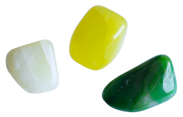

<h1 align="center">
<picture>

</picture> Jada
</h1>

Extensible [Javadoc doclet](https://docs.oracle.com/en/java/javase/17/docs/api/jdk.javadoc/jdk/javadoc/doclet/Doclet.html) enabling users to combine an arbitrary doclet with multiple pre/post-processors in order to transform its output in more flexible and convenient ways.

> [!NOTE]
> The current implementation is focused on HTML-based [StandardDoclet](https://docs.oracle.com/en/java/javase/17/docs/api/jdk.javadoc/jdk/javadoc/doclet/StandardDoclet.html), as it is by far the most common; [further doclets](docs/TODO.md#base-doclet-generalization) will be supported as they become relevant.

## Introduction

Despite its ubiquity in the standard Java development environment, Javadoc is commonly perceived as a dull tool of the trade whose reusability is a bit neglected if not discouraged (its clumsy, minimalist public API, its overly-defensive implementation and its scarce, almost non-existent, hands-on documentation make for a (to be gentle) bumpy development experience, forcing developers to devise ugly workarounds even for the most obvious repurposing — for example, the standard doclet doesn't tolerate injection of a custom `DocletEnvironment` other than internal `DocEnvImpl`, thus obstructing useful pre-processing transformations, unless JDK internals are horribly unlocked).

*The traditional design of custom doclets is monolithic*: main generation is delegated to the standard doclet (HTML output) and pre-processed (for example, for source files with [alternate Javadoc formats such as Markdown](https://github.com/Abnaxos/markdown-doclet) (before [Java 23](https://openjdk.org/jeps/467)) or [AsciiDoc](https://github.com/asciidoctor/asciidoclet)) or post-processed (for example, [to add UML diagrams](https://github.com/talsma-ict/umldoclet) to the generated documentation files), or (less frequently) the entire generation is implemented from scratch (for example, for alternate output formats such as XML) — in any case, just a single hard-coded set of features can be applied to a doclet. *This single-extensibility model can be annoyingly limiting in case multiple specialized doclets need to be placed on the same Javadoc toolchain*. Some doclets try to mitigate this by allowing users to pass their own doclet delegate; such jury-rigged solutions, however, lack the consistency of a common mechanism to easily chain doclet functionalities. Furthermore, the minimalism of Doclet API forces doclets to reimplement common functionalities over and over.

Jada tries to fill this gap as a tiny framework on top of the Javadoc tool: with minor tweaks, *existing doclets can be adapted to work together on the same Javadoc execution as specialized components (doclet extensions)*, with the additional benefits of a simple, intuitive and user-friendly API (each and every object in its model extends a single class, `JadaObject`, which provides direct access to all the relevant parts of the model) which relieves them of common chores like **options definition** (a dedicated builder provides ready-to-use option creation with transparent option overriding, parameter composition, text localization, ...), **message logging** (enhanced printing with parameterized, localized and contextualized (caller's parent component, instance class and stack location) messages, ...), **shared page resources** (such as javascripts and stylesheets, dynamically insertable and optimized), **input** (Java source code) **and output** (generated documentation) **transformation** (pluggable file processors), **taglets integration** (overcoming architectural limitations which affect the interaction between taglets and doclet), **Javadoc testing harness**, and so on.

For a real-world example of the successful porting of existing doclets to Jada, see [JadaUML](jada-uml).

### See also

- <https://docs.oracle.com/en/java/javase/17/docs/api/jdk.javadoc/jdk/javadoc/doclet/package-summary.html>
- <https://openjdk.org/groups/compiler/using-new-doclet.html>

## Usage

See [Usage](docs/usage.md) for complete details.

## Building

See [Building](docs/building.md) for complete details.

## Debugging

See [Debugging](docs/building.md#debugging) for complete details.

## Documentation

See [Documentation](docs/README.md) for further information about this project.

## Examples

See [Jada Examples](https://github.com/pdfclown/jada-examples).

## License

This project is licensed under **[GNU Lesser General Public License (LGPL), version 3.0](LICENSE.txt)**.

See [NOTICE](NOTICE.txt) for attributions.

See [REUSE compliance report](https://api.reuse.software/info/github.com/pdfclown/jada) for detailed licensing and copyright information.

## Home

<https://github.com/pdfclown/jada>
